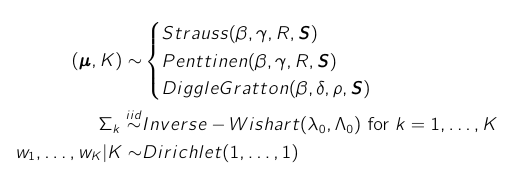
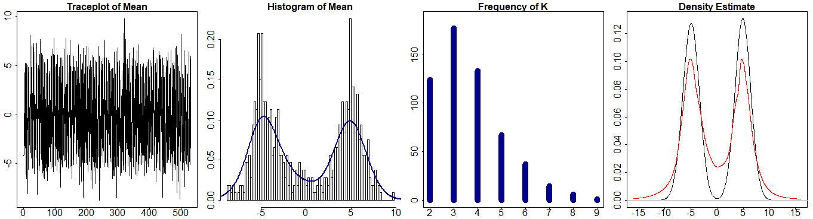
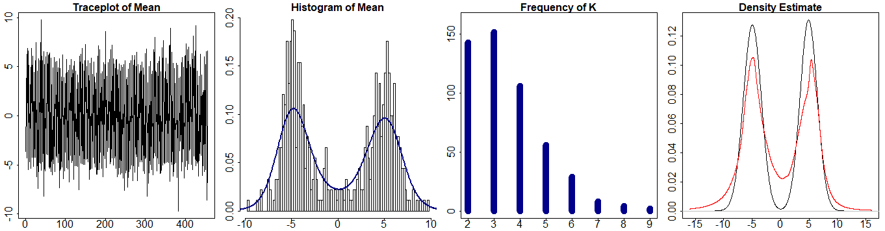
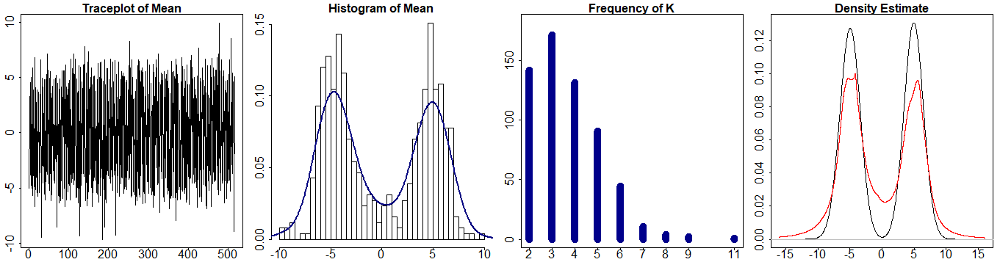

<!-- TABLE OF CONTENTS -->

  
Table of Contents

  <ol>
    <li><a href="#about-the-project">About The Project</a> </li>
    <li><a href="#usedPackages">Packages</a></li>
    <li><a href="#structre-of-code">Repo Structure</a></li>
    <li><a href="#results">Results Overview</a></li>
  </ol>

<!-- ABOUT THE PROJECT -->
## About The Project

The aim of this project was to study ABC Sampling Techniques for repulsive mixture models in order to solve clustering problems. The code was developed in R considering incrementally more general problems. The most general model formulation is the following:

### Packages

The entire code was written in R. The important packages we used are:
* coda, gtools, transport, MCMCpack

* MASS, extraDistr, spatstat
 
## Repo Structure

In the code directory you can find all the code: to run the sampler you just need to open the main file, which is ABCForNormalMixture. In the images directory there are the pictures needed for the readme file, while in the data directory we uploaded some of the most meaniningful simulations.

## Results Overview

Below you can see the results obtained when running our sampler on a Gaussian Mixture using three different repulsive priors:

 
 
 
